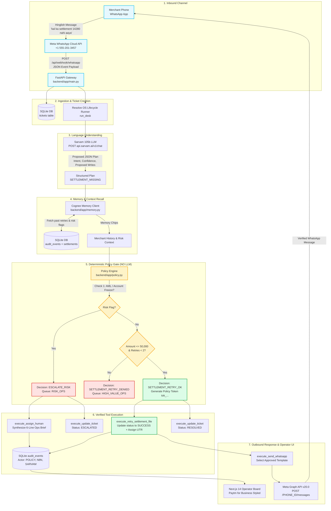

# Resolve OS — Autonomous AI Teammate for Merchant Support

> **Track:** Autonomous AI Teammates  
> **Event:** Paytm ♥ AI Hackathon · Delhi · 19 September 2026  
> **Core Principle:** *Sarvam proposes. Policy decides. Tools act. Cognee remembers.*  
> **Live Web Board:** https://paytm-desk.vercel.app  
> **GitHub Repository:** https://github.com/sparsh101sparsh/resolve-os  
> **Official WhatsApp Channel:** `+1 (555) 201-3457` (Meta WhatsApp Cloud API Sandbox)

---

## Who Processes the Messages? (Processing Pipeline)

When a merchant sends a Hinglish message on WhatsApp, **five distinct systems collaborate in a strict, safety-first pipeline**:

```
[Merchant Phone] ──(WhatsApp)──► [Meta Cloud API] ──(Webhook)──► [FastAPI Gateway]
                                                                        │
┌────────────────────────── THE RESOLVE OS CORE ────────────────────────┴──────────────┐
│                                                                                      │
│   1. SARVAM AI (sarvam-105b)      Comprehends Hinglish & proposes a structured plan   │
│                 │                                                                    │
│   2. COGNEE MEMORY LAYER          Recalls past merchant retries & risk flags from DB  │
│                 │                                                                    │
│   3. DETERMINISTIC POLICY ENGINE  Zero-LLM hard rules: checks ₹50k cap, freeze, UTR  │
│                 │                 Generates cryptographic policy token (tok_xxxx)    │
│                 │                                                                    │
│   4. TOOL EXECUTION RUNTIME       Retries settlement file, updates tickets, logs audit │
│                 │                                                                    │
│   5. META GRAPH API DISPATCHER    Sends official WhatsApp reply to merchant's phone  │
└──────────────────────────────────────────────────────────────────────────────────────┘
```

1. **Meta WhatsApp Cloud API**: Receives the incoming merchant message on phone `+1 (555) 201-3457` and forwards the webhook payload to FastAPI (`POST /api/webhook/whatsapp`).
2. **Sarvam AI (`sarvam-105b`)**: Parses the raw Hinglish text (e.g. *"kal se 14,280 ka settlement nahi aaya"*), identifies the intent (`SETTLEMENT_MISSING`), and proposes a structured draft plan. **Sarvam proposes only—it has zero authority to move money.**
3. **Cognee Agent Memory Layer**: Queries past merchant settlement history, active risk flags (e.g., AML / `ACCOUNT_FROZEN_SUSPECT`), and past retry attempts from SQLite audit history.
4. **Deterministic Policy Engine (`backend/app/policy.py`)**: A pure, non-LLM rule engine that evaluates the proposed plan against Paytm operational limits:
   - Max auto-settlement retry: **₹50,000**
   - Max retries allowed: **2**
   - Age check: **< 48 hours**
   - Max refund auto-action: **₹2,000** (requires verified 12-digit UTR; otherwise asks merchant)
   - Freeze/AML check: **Hard escalate to human Risk Ops**
   - Issues a tamper-evident audit token: `tok_sha256(...)`
5. **Tool Execution Engine (`backend/app/tools.py`)**: Executes approved tools (batch retry, ticket update, WhatsApp template synthesis) and writes every event to the immutable `audit_events` ledger.
6. **Meta Outbound Dispatcher**: Dispatches the verified Hinglish WhatsApp notification back to the merchant's phone via Meta Graph API.

---

## Detailed System Architecture



---

## Honest Partner Stack Breakdown

| Component | Role in Resolve OS | Implementation Status |
|---|---|---|
| **Sarvam AI (`sarvam-105b`)** | Hinglish natural language comprehension & structured action plan proposals | ✅ **Live API** (`https://api.sarvam.ai/v1/chat/completions`) |
| **Deterministic Policy Engine** | Non-LLM mathematical and boolean rule engine enforcing financial risk limits | ✅ **Real code + 100% test coverage** |
| **FastAPI + SQLite Backend** | Runs core lifecycle, maintains ledger, generates audit tokens | ✅ **Live local & Vercel runtime** |
| **Meta WhatsApp Cloud API** | Inbound merchant messaging webhook & outbound templated notifications | ✅ **Live on Sandbox phone `+1 555-201-3457`** |
| **n8n Workflow Runtime** | Visual orchestration graph (`n8n/desk-merchant-ticket.json`) | ✅ **Importable JSON workflow** (run locally to watch nodes turn green) |
| **Cognee Agent Memory** | Historical recall of merchant retry counts & past dispute resolutions | ⚠️ **Simulated via SQLite audit history** (`COGNEE_OPTIONAL=1`) |
| **Paytm Core Ledger** | Settlements, transactions, merchants, and devices tables | ✅ **Seeded realistic test data** (labeled TEST DATA) |

> **The Honest Line:** Sarvam 105b, Meta WhatsApp Cloud API, and our deterministic policy engine are completely real and live. n8n workflow ships as an importable JSON graph. Cognee is simulated via our local SQLite audit history. Paytm core banking APIs are simulated via SQLite test fixtures.

---

## Three Hero Scenarios (Tested & Proven)

| Ticket ID | Merchant | Complaint Text | Autonomous Policy Decision | Real Outcome in DB & WhatsApp |
|---|---|---|---|---|
| **T-1042** | Sharma Kirana (Karol Bagh) | *"Kal se settlement nahi aaya. UTR bhi nahi dikh raha."* (₹14,280 stuck) | `SETTLEMENT_RETRY_OK` | Batch retried, UTR assigned, WhatsApp sent to merchant, Ticket `RESOLVED`. |
| **T-1048** | Glow Salon (Lajpat Nagar) | *"Customer bol raha hai paise kat gaye... refund karo"* (3 candidate txns) | `ASK_MERCHANT_UTR` | Zero refunds processed, Ticket `WAITING_ON_MERCHANT`, WhatsApp asks for 12-digit UTR. |
| **T-1055** | Delhi Electronics (Nehru Place) | *"1.84 lakh settlement fail ho gaya turant account check karo"* (AML suspect) | `ESCALATE_RISK` | Zero retries attempted, Ticket `ESCALATED`, 6-line operational brief sent to `RISK_OPS`. |

### The Anti-Hardcoding Mutation Proof
If you edit the settlement amount in SQLite for **T-1042** from ₹14,280 to **₹60,000** and run it:
- Resolve OS immediately rejects the auto-retry with reason `SETTLEMENT_RETRY_DENIED_AMOUNT` and escalates.
- **Zero** `if (ticket_id == "T-1042")` checks exist anywhere in the codebase. Every decision is computed purely from state.

---

## Policy Evaluation Benchmark — 40 Synthetic Hinglish Tickets

```
Resolve OS Policy Eval — 40 synthetic Hinglish tickets
─────────────────────────────────────────────────────────
Correct decisions : 40 / 40  (100.0%)
Wrong decisions   : 0
Unsafe actions    : 0   ← money moved on a wrong decision
─────────────────────────────────────────────────────────
All tickets: synthetic. No real merchants or money involved.
```

Run the benchmark locally:
```bash
PYTHONPATH=. python backend/tests/eval_policy.py
```

Covers:
- Settlement retry approvals (clean initiated batches < ₹50k)
- Over-amount blocks (>= ₹50k)
- Status checks (SUCCESS or PROCESSING batches blocked from retry)
- Maximum retry limits (retry_count >= 2 blocked)
- Account freeze & AML risk flag escalations
- Ambiguous multi-transaction refund requests (requires UTR)
- Boundary checks (₹50,000 exact, ₹2,000 exact)
- Device & QR hardware issues safely routed to human desks

---

## Quickstart & Installation

### 1. Prerequisites
- Python 3.10+
- Node.js 18+ & npm
- SQLite3

### 2. Backend Setup
```bash
# Clone and enter directory:
git clone https://github.com/sparsh101sparsh/resolve-os.git
cd resolve-os

# Create virtual environment:
python3 -m venv .venv
source .venv/bin/activate
pip install -r requirements.txt

# Seed SQLite database:
python -m backend.app.seed

# Run FastAPI server on port 8000:
uvicorn backend.app.main:app --reload --port 8000
```

### 3. Frontend Dashboard Setup
```bash
cd frontend
npm install
npm run dev
# Open http://localhost:3000 in your browser
```

### 4. Running the Test Suite
```bash
PYTHONPATH=. pytest backend/tests/ -v
```
Runs all 11 unit, scenario, and WhatsApp webhook integration tests.

### 5. Running the WhatsApp Bot (Meta Cloud API)
Configure credentials in `.env`:
```bash
SARVAM_API_KEY=your_sarvam_key
WHATSAPP_TOKEN=your_permanent_system_user_token
WHATSAPP_PHONE_NUMBER_ID=1329851416876776
WHATSAPP_VERIFY_TOKEN=paytm_desk_hackathon_2026
```

Expose local webhook via Cloudflare Tunnel:
```bash
cloudflared tunnel --protocol http2 --url http://localhost:8000
```
Set the tunnel URL in Meta Developer Console under **WhatsApp ➔ Configuration ➔ Webhook**:
`https://<your-subdomain>.trycloudflare.com/api/webhook/whatsapp`

---

## Resetting Demo State
To restore all database tables to the fresh starting state:
```bash
curl -X POST http://localhost:8000/api/demo/reset
```
Or click the **"Reset demo"** button on the web dashboard.
